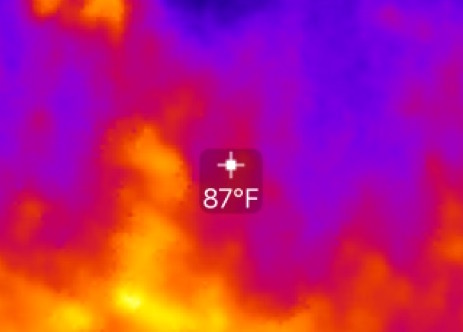

---
title:
author: "cjlortie"
date: "June 2016"
output:
  html_document:
    theme: yeti
    toc: yes
    toc_depth: 3
    toc_float: yes
  pdf_document:
    toc: yes
---

#### An analysis of infrared technology to assess soil moisture patterns associated with shrubs in deserts.
A Seek Compact Thermal Imager for iOS was tested in desert ecosystems in conjunction with a soil moisture probe on shub-open micoenvirnments. The hypothesis is that shrub canopy decadence is an important factor mediating shrub effects on microenvironmental dynamics.



[ecoblender](http://ecoblender.org)

```{r setup, include=FALSE}
knitr::opts_chunk$set(echo = TRUE)
```

